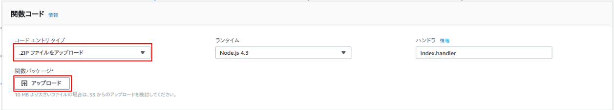
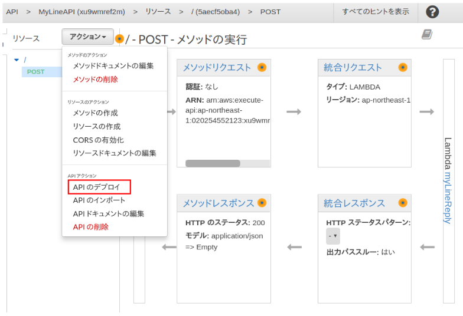
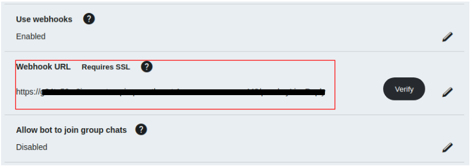

# How to set LINE BOT up on AWS Lambda
### 2018/05/11時点

*LINE* と *AWS Lambda* と *Node.js* を使って、LINEに投稿した内容をそのままオウム返しするbotを作成します。  
前提条件として作成者は（LINE含む）API操作の経験ももAWS Lambdaを使ったこともコーディングとしてNode.jsも利用したこともありません。  

## 事前に準備するもの
* LINE developersのアカウント(多分無料)
* AWSのアカウント（多分ちょっと有料）

ここはいい感じにやってください。

## 環境情報
実行環境はUbuntu
~~~
$ lsb_release -a
No LSB modules are available.
Distributor ID:	Ubuntu
Description:	Ubuntu 16.04.4 LTS
Release:	16.04
Codename:	xenial
~~~

## 大まかな手順

1. Lambdaで関数の作成
2. 作成したLambda関数にNode.jsをセットする
3. Amazon API Gateway の設定
4. LINE DevelopersコンソールにURLの登録
5. 
6. 
7. 

## Lambdaで関数の作成
1. Lambdaのコンソールを開き「関数の作成」をクリック  
    
  「一から作成」を選び下記を入力する  
    ```
    名前：【好きな名前】  
    ランタイム： *Node.js4.3*
    ```
    

2. IAMロールの作成
「ロール」から「カスタムロースの作成」を選択してクリックすると新しいウィンドウが開かれる

    下記を入力してロールを作成する
    ```
    IAMロール： *新しいロールの作成*
    ロール名： 【好きな名前】  
    ```
      
    元の画面に戻って進めるとLambda関数が作成される   
    

## 作成したLambda関数にNode.jsをセットする

1. ローカルにNode.jsをインストールする  
今回はLINE SDKを利用するのでNode.jsを使うための準備をします。

下記Node.jsの公式サイトからインストールします。  
Versionに注意してください。今回は4.3をインストールする必要があります。
```
https://nodejs.org/ja
```

同様にLINEのSDKをダウンロードします。

```
npm install @line/bot-sdk
```

コマンドが使えない場合は下記から入手してください。
```
https://www.npmjs.com/package/@line/bot-sdk
```

最終的に下記のようにします。
```
/【任意のディレクトリ】/node_modules/@line
```
今回は下記の例で進めます。
```
~/linebot/lambda/node_modules/@line
```

2. Lambdaでの具体的な処理をnode.jsで記述する  
    *lambda* ディレクトリにindex.jsを作成してください。
    ```
    ~/linebot/lambda/index.js
    ```
    index.jsの中身は下記のようにします。
    ```
    'use strict';
    const line = require('@line/bot-sdk');
    const LINE_ACCESS_TOKEN = process.env[`LINE_ACCESS_TOKEN`]
    var event;
    var context;
    var callback;
    exports.handler = (_event, _context, _callback) => {
        event    = _event;
        context  = _context;
        callback = _callback;
        main();
    };
    let main = function() {
        const client = new line.Client({
            channelAccessToken: LINE_ACCESS_TOKEN
        });
        const message = {
            type: 'text',
            text: event.events[0].message.text
        };
        client.replyMessage(event.events[0].replyToken, message)
        .then(() => {
            callback(null, {});
        })
        .catch((err) => {
            callback(null, {});
        });
    };
    ```
    *index.js*と*node_module*をzipに圧縮します。  
    *lambda*ディレクトリごとではなく中のファイルとサブディレクトリのみ選択して圧縮してください。  
    圧縮後の名前は何でも大丈夫です。  

    3. Node.jsをlambdaにアップロードする
        圧縮したzipをlambdaにアップロードします。
        
        今後ソースを編集する場合は、Lambdaの画面から直接編集も可能です。

## 3. Amazon API Gateway の設定
1. API Gatwayの作成  
    AWSのコンソールに戻り、Amazon API Gatewayの管理コンソールを開きます。  
      
    ・APIの名前は任意のもので問題ありません  
    ・エンドポイントタイプは「エッジ最適化」  
      
    
    アクション＞メソッドの作成から*POST*メソッドを作成します。
      
    統合タイプ：*Lambda関数*を選択し、Lambda関数に先ほど作成したLambdaを指定します。  
      

    アクション＞APIのデプロイをクリックします。  
      
    「デプロイされるステージ」は*新しいステージ*を選択し、ステージ名には似にの名前を入力してください。
    *ステージ名はURLになります。*  
        
    APIのURLが作成されました。
    F
    このURLは後ほどLINEのDeveloperコンソールに登録します。

## 4. LINE DevelopersコンソールにURLの登録  
1. コンソールからURLの登録
        
    このとき、*https*部分はもとから入力されているためコピペする際は注意